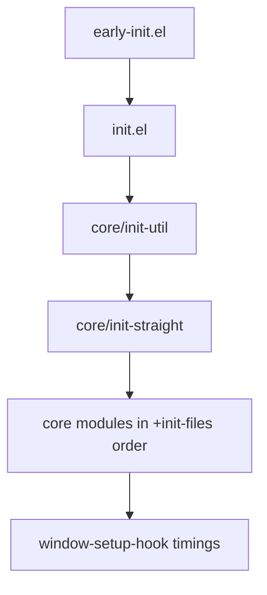

# .emacs.d

<p align="center">
  <strong>Dragonshock's personal Emacs configuration</strong><br/>
  modular · straight.el · use-package · Emacs 31
</p>

<p align="center">
  <a href="https://www.gnu.org/software/emacs/"></a>
  <a href="https://github.com/radian-software/straight.el"></a>
  <a href="https://github.com/jwiegley/use-package"></a>
  
  
</p>

一套面向 **Emacs 31** 的模块化个人配置：启动优化、现代化补全、Tree-sitter + Eglot、Ghostel 终端，以及 gptel / Claude Code / Codex 等 AI 工作流。主平台为 **macOS**，Linux 为次要支持。

> 本仓库 fork / 演进自 [roife/.emacs.d](https://github.com/roife/.emacs.d)，并持续按个人工作流定制。

---

## Highlights

| | |
|---|---|
| **启动** | `early-init` GC / 帧参数 / native-comp；模块按序加载；启动耗时打印到 `*Messages*` |
| **补全** | Vertico + Orderless + Marginalia + Consult + Embark + Corfu + Cape + Tempel |
| **编辑** | Eglot (+ booster)、Flymake、Tree-sitter、Citre、Puni、Expreg、Dogears |
| **终端** | [Ghostel](https://github.com/roife/ghostel)（Ghostty VT 引擎）+ compile / comint / eshell 集成 |
| **VCS** | Magit · Forge · diff-hl · consult-gh · Difftastic |
| **AI** | gptel (DeepSeek) · gptel-magit · Claude Code IDE · Codex IDE |
| **写作** | Org (modern / appear / valign) · AUCTeX · markdown-ts · Scheme / Geiser |

---

## Table of contents

- [Screenshots](#screenshots)
- [Requirements](#requirements)
- [Install](#install)
- [Layout](#layout)
- [Startup flow](#startup-flow)
- [Keybindings](#keybindings)
- [Feature map](#feature-map)
- [Conventions](#conventions)
- [Customize](#customize)
- [Notes](#notes)

---

## Screenshots

> 欢迎自行截图后放到 `docs/screenshots/` 并在此引用。当前仓库未附带预览图。

```text
docs/screenshots/
├── dark.png      # doric-valley
└── light.png     # doric-beach
```

---

## Requirements

### Emacs

- **Emacs 31+**（开发测试版本：`31.0.90` / emacs-plus）
- 推荐启用 native-comp

### Fonts

| Role | Family |
|------|--------|
| Default / fixed | **MonoLisaCode** |
| Variable pitch | **MonoLisaText** |
| CJK | **LXGW WenKai Mono Screen** |
| Emoji (macOS) | **Apple Color Emoji** (rescale `0.79`) |
| Emoji (other) | **Noto Color Emoji** |

### CLI tools

| Tool | Used for |
|------|----------|
| [`rg`](https://github.com/BurntSushi/ripgrep) | search / xref |
| [`fd`](https://github.com/sharkdp/fd) | file find / dired |
| `aspell` | spell-check |
| [`difft`](https://github.com/Wilfred/difftastic) | structural diff in Magit |
| `readability-cli` | cleaner EWW pages |
| `zstd` *(optional)* | undo-fu-session compression |
| `gls` *(optional, macOS)* | GNU `ls` for dired |
| `tdlib` *(optional)* | telega |
| C toolchain *(first install)* | `emacs-reader` native module |

```bash
# macOS (Homebrew) example
brew install emacs-plus@31 ripgrep fd aspell difftastic zstd coreutils
# optional
brew install tdlib
```

### Theme path

主题使用 [doric-themes](https://github.com/protesilaos/doric-themes)，当前通过本地路径加载：

```elisp
:load-path "/Users/dragon/code/doric-themes"
```

克隆本配置后请改成你自己的路径，或改回 straight 安装。

默认明暗主题：

| Appearance | Theme |
|------------|--------|
| Light | `doric-beach` |
| Dark | `doric-valley` |

macOS 下会跟随 `ns-system-appearance` 自动切换。

---

## Install

```bash
# Backup any existing config
mv ~/.emacs.d ~/.emacs.d.bak 2>/dev/null

git clone https://github.com/Dragonshock/.emacs.d.git ~/.emacs.d
```

1. 安装上方字体与 CLI 依赖  
2. 修改 `core/init-ui.el` 中的 `doric-themes` `:load-path`（或改用 straight）  
3. 首次启动 Emacs：`straight.el` 会自动 bootstrap 并拉取包（可能较久）  
4. 需要 AI 时，在 `auth-source`（如 `~/.authinfo.gpg`）配置 DeepSeek / 相关 API key  

```text
machine api.deepseek.com login apikey password sk-...
```

---

## Layout

```text
.emacs.d/
├── early-init.el      # 启动前：GC、帧、package.el、闪屏抑制
├── init.el            # +init-files 注册表 + 按序 load-file
├── core/              # 全部业务模块（init-*.el）
│   ├── init-util.el   # add-hook! / defadvice! 等宏
│   ├── init-straight.el
│   ├── init-basic.el
│   ├── init-ui.el
│   ├── init-ghostel.el
│   ├── init-completion.el
│   ├── init-prog.el
│   ├── init-ai.el
│   └── ...
├── tempel-templates   # Tempel 模板
└── scripts/           # 辅助脚本（如 telega tdlib）
```

模块顺序由 `init.el` 中的 **`+init-files`** 唯一决定（后加载可依赖先加载）。

| Module | Responsibility |
|--------|----------------|
| `init-util` | 自定义宏 |
| `init-straight` | straight + use-package 默认值 |
| `init-basic` | 文件/备份/滚动/TRAMP/GCMH/history |
| `init-ui` | 字体、主题、ligature、scrollview |
| `init-xterm` | TTY / Kitty graphics / kkp |
| `init-ghostel` | 终端模拟器 |
| `init-mac` | macOS 专用（系统外观、词典） |
| `init-completion` | Vertico / Corfu / Consult / Embark … |
| `init-tools` | project、undo、isearch、avy … |
| `init-keybinding` | Super 键、中文标点翻译 |
| `init-highlight` | 括号、TODO、pulse、symbol-overlay |
| `init-edit` | 编辑增强、electric-pair、embrace |
| `init-window` | ace-window、popper、zoom |
| `init-dired` | dired 全家桶 |
| `init-eshell` | Eshell 增强 |
| `init-prog` | LSP / treesit / 语言模式 |
| `init-scheme` | Geiser |
| `init-writing` | Markdown / AUCTeX |
| `init-org` | Org 外观与导出 |
| `init-vcs` | Magit / Forge / diff-hl |
| `init-ai` | gptel / Claude / Codex |
| `init-chat` | telega |
| `init-pdf` | emacs-reader |
| `init-elfeed` | RSS |
| `init-test` | 个人实验 / rust-analyzer 辅助（**不是**单元测试） |

注释掉的模块：`init-ime`、`init-modal`。

---

## Startup flow



1. **`early-init.el`** — 提高 GC 阈值、native-comp、关闭 package.el 启动初始化、设置 `default-frame-alist`（160×60、tab-bar、无 menu/tool/scroll bar）、抑制启动闪烁  
2. **`init.el`** — 按 `+init-files` `load-file` 每个模块  
3. **交互会话** — `use-package-always-defer` 为 `t`（延迟加载）；daemon 下 `use-package-always-demand` 为 `t`  

启动后在 `*Messages*` 可见类似：

```text
window-setup: x.xxxs, after-init: y.yyys
```

---

## Keybindings

### Super (macOS ⌘)

| Key | Command |
|-----|---------|
| `s-s` | save-buffer |
| `s-x` / `s-c` / `s-v` | kill / copy / yank |
| `s-z` / `s-Z` | undo / undo-redo |
| `s-a` | mark-whole-buffer |
| `s-w` / `s-t` | tab-close / tab-new |
| `s-o` | other-window |
| `s-,` | xref-go-back |
| `s-.` | embark-dwim |

### Search & navigation

| Key | Command |
|-----|---------|
| `M-s l` | consult-line |
| `M-s r` | consult-ripgrep |
| `M-s d` | consult-fd |
| `C-c i` / `C-c I` | consult-imenu / multi |
| `C-.` | embark-act |
| `M-.` | embark-dwim |
| `M-s e` | embrace-commander |

### `C-,` ad-hoc prefix

| Key | Command |
|-----|---------|
| `C-, .` / `C-, ,` / `C-, l` | avy-goto-char / char-2 / line |
| `C-, j` / `C-, c` | link-hint open / copy |
| `C-, g l` / `c` / `h` | git-link / commit / homepage |
| `C-, w` | google-this |

### Project · Magit · Terminal · AI

| Key | Command |
|-----|---------|
| `C-x p m` | magit-status |
| `C-x p t` / `T` | ghostel-project / list buffers |
| `C-x g` | magit |
| `C-x m` | ghostel |
| `C-c C-'` | claude-code-ide-menu |
| `C-c r t` | gptel rewrite → 简体中文 |

### Programming

| Key | Command |
|-----|---------|
| `C-c r` | quickrun |
| `C-c c j/k/p/a/u` | citre jump / back / peek / ace / update |
| `C-c f ]` / `[` / `b` | flymake next / prev / buffer |
| `M-RET` *(eglot)* | code actions |

中文标点在 `C-` / `M-` / `s-` / `H-` 前缀下会通过 `key-translation-map` 映射为英文标点，避免输入法干扰绑定。

---

## Feature map

### Completion stack

```text
Vertico ── Orderless ── Marginalia
   │
Consult / Embark ── actions & search
   │
Corfu + Cape + Tempel ── in-buffer completion / snippets
```

### Programming

- **LSP**: built-in Eglot + `eglot-booster`（`io-only`）+ `consult-eglot`
- **Diagnostics**: Flymake（行尾短提示）
- **Tree-sitter**: `treesit-enabled-modes t`，grammar `always` 自动安装，font-lock level 4
- **Rust**: `rust-mode-treesitter-derive`、cargo minor mode
- **Jump**: Citre + dumb-jump fallback + xref（ripgrep）

### Ghostel

- 绑定 `C-x m`；项目终端 `C-x p t`
- 子模式：`ghostel-compile` / `ghostel-comint` / `ghostel-eshell`
- TRAMP 远程 shell、OSC 52 剪贴板、Kitty 图形能力
- 输入模式：semi-char / char / emacs / copy / line

### AI

| Package | Role |
|---------|------|
| **gptel** | DeepSeek chat（thinking 默认开）、org 会话 |
| **gptel-quick** | Embark `?` 一句话解释 |
| **gptel-magit** | Conventional Commits 风格提交说明 |
| **claude-code-ide** | Claude Code CLI + MCP + Ghostel 侧栏 |
| **codex-ide** | OpenAI Codex IDE 集成 |

### Org & writing

- `org-modern` + `org-modern-indent` + `org-appear` + `valign`
- LaTeX preview（dvisvgm）、CJK 强调正则 hack
- AUCTeX / cdlatex / reftex；`markdown-ts-mode`

### Windows & UI

- Popper 弹出窗口、Zoom 主窗、ace-window 编号
- 自定义 modeline + breadcrumb header-line
- tab-bar、window-divider、ligature、scrollview fringe

---

## Conventions

| Pattern | Meaning |
|---------|---------|
| `+name` | 本配置自定义函数 / 变量 |
| `*-a` / `*-h` | `defadvice!` 命名：around / hook |
| `lexical-binding: t` | 每个文件首行声明 |
| `:straight t` | 第三方包 |
| `:straight (:type built-in)` / `nil` | 内置或父包附带扩展 |
| `custom.el` | Customize 落盘（gitignore） |
| `autosaves/` · `backups/` | 自动保存与备份（gitignore） |

核心宏（`core/init-util.el`，风格接近 Doom）：

- `add-hook!` — 多 hook / 多函数，支持 `:local`、`:append`、`:call-immediately`、`:unless-daemonp-call-immediately`
- `defadvice!` — 定义并挂载 advice
- `+advice-pp-to-prin1!` — 缩小 saveplace / recentf 等缓存体积

---

## Customize

### 新增包

在对应 `core/init-*.el` 增加 `use-package`；若需新模块：

1. 新建 `core/init-foo.el`
2. 把 `'init-foo` 加入 `init.el` 的 `+init-files`（**顺序敏感**；勿放在 `init-straight` 之前）

### 常用旋钮

| Want | Where |
|------|--------|
| 主题明暗 | `core/init-ui.el` → `+light-theme` / `+dark-theme` |
| 字号 | `core/init-ui.el` → `+font-size` |
| AI 模型 / backend | `core/init-ai.el` |
| 自动 Eglot 语言 | `core/init-prog.el` → `+eglot-auto-start-modes` |
| 模块开关 | `init.el` → `+init-files`（注释即可禁用） |

### 热重载单个模块

```text
M-x load-file RET core/init-FOO.el RET
```

注意：`use-package-always-defer` 为 `t` 时，`:config` 要等真正加载该包后才会再跑。

---

## Notes

- **`init-test.el` 不是测试套件**，会正常加载，里面是个人实验与工具函数。  
- **无自动化测试**；验证方式：启动 Emacs，看 `*Messages*` 耗时，手动点功能。  
- 本地路径（主题、机器相关绝对路径）clone 后需要按机器改写。  
- 上游参考：[roife/.emacs.d](https://github.com/roife/.emacs.d)

---

## License

个人配置，按需自取。第三方包遵循各自许可证。  
若你基于本配置衍生，欢迎 star / fork，并保留对上游 roife 配置的致谢。

---

<p align="center">
  <sub>Built for thinking with code · Emacs 31</sub>
</p>
